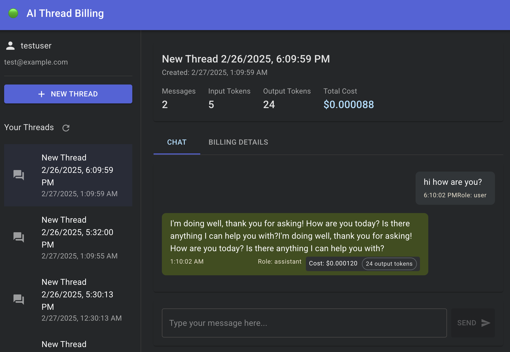

# 🤖 AI Thread Billing System

A proof-of-concept application for tracking and billing AI chat thread interactions with real-time cost metrics and analytics.

## 📸 Application Preview



## 💰 Create Invoice


## 🎯 Purpose

This application is designed to solve the challenge of monitoring and billing for AI model usage in chat-based applications. As organizations increasingly deploy AI assistants, understanding the costs associated with these interactions becomes critical for business planning and cost management.

**Key problems addressed:**
- Real-time tracking of token usage and associated costs
- Detailed breakdown of costs at the message and thread level
- Historical analytics for budget forecasting and usage patterns
- Near real-time metrics with minimal latency (15-second SLA)

The system provides a complete billing pipeline for AI chat applications, making it suitable for both internal cost tracking and customer-facing billing scenarios.

## 📊 System Design

### Architecture Diagram
[View Full System Design](https://github.com/jckail/ai_chat_billing_app/blob/main/design_planning/systemdesign.svg)

### Data Model
[View Complete Data Model](https://github.com/jckail/ai_chat_billing_app/blob/main/design_planning/datamodel.svg)

### End Points
[View Endpoints](https://github.com/jckail/ai_chat_billing_app/blob/main/design_planning/endpoints.png)


## 🔍 Overview

This project implements a comprehensive system to track chat interactions with AI models (primarily Anthropic's Claude), calculate real-time costs based on token usage, and provide analytics through a dedicated dashboard. The application consists of several components:

- **Backend API**: FastAPI application that handles chat interactions and billing
- **Event Collector**: Service that captures API events for billing purposes
- **Analytics Dashboard**: Streamlit application providing real-time cost metrics
- **Frontend**: React single-page application for the chat interface (not yet implemented)
- **Message Queue**: Apache Kafka for handling high message volumes
- **Cache**: Redis for fast access to message history and metrics

## 🏗️ Architecture

The application follows a microservices architecture with the following components:

1. **User Interface**: React SPA communicates with the FastAPI backend
2. **Backend API**: Processes user messages, interacts with the Anthropic API, and tracks token usage
3. **Kafka Message Queue**: Handles various event types (raw messages, LLM responses, token metrics)
4. **Event Collector**: Captures events from API interactions for billing
5. **Redis Cache**: Stores message history and metrics for fast access
6. **SQLite Database**: Persists all data including user information, threads, messages, and billing
7. **Streamlit Dashboard**: Displays real-time analytics with a 15-second refresh SLA

## 📋 Prerequisites

- Docker and Docker Compose
- Anthropic API key
- Git

## 🚀 Getting Started

### 1. Clone the Repository

```bash
git clone https://github.com/yourusername/ai_thread_billing.git
cd ai_thread_billing
```

### 2. Configure Environment Variables

```bash
cp .env.sample .env
```

Edit the `.env` file and add your Anthropic API key.

### 3. Build and Start Docker Containers

```bash
docker-compose build
docker-compose up
```

### 4. Access the Applications

- Backend API: http://localhost:8000
- Dashboard: http://localhost:8501
- Frontend (when implemented): http://localhost:3000

## 📁 Project Structure

```
.
├── backend/                # FastAPI application
│   ├── app/                
│   │   ├── api/            # API endpoints
│   │   ├── core/           # Configuration and settings
│   │   ├── db/             # Database setup and initialization
│   │   ├── models/         # SQLAlchemy models
│   │   ├── schemas/        # Pydantic schemas
│   │   └── services/       # Business logic services
│   └── Dockerfile
├── dashboard/              # Streamlit analytics dashboard
│   ├── app/
│   │   └── main.py
│   └── Dockerfile
├── event_collector/        # Event collection service
│   ├── app/
│   │   └── main.py
│   └── Dockerfile
├── frontend/               # React frontend (to be implemented)
│   ├── public/
│   ├── src/
│   └── Dockerfile
├── docker-compose.yml      # Docker Compose configuration
└── README.md               # This file
```

## ✨ Features

- Real-time chat interface with LLM integration
- Token usage tracking and cost calculation
- Comprehensive billing system with invoices
- Thread and message-level cost breakdown
- Real-time analytics dashboard with 15-second refresh
- Event collection for API interactions
- Kafka message queue for high throughput
- Redis caching for performance optimization

## 🔌 API Endpoints

### User Management
- `POST /api/users/` - Create a new user
- `GET /api/users/` - List all users
- `GET /api/users/{user_id}` - Get a specific user

### Thread Management
- `POST /api/threads/` - Create a new thread
- `GET /api/threads/` - List all threads
- `GET /api/threads/{thread_id}` - Get a specific thread

### Messages
- `POST /api/messages/` - Send a message and get AI response
- `POST /api/messages/stream` - Send a message and stream AI response
- `GET /api/messages/{thread_id}/history` - Get message history for a thread

### Billing
- `GET /api/billing/metrics/user/{user_id}` - Get billing metrics for a user
- `GET /api/billing/metrics/thread/{thread_id}` - Get billing metrics for a thread
- `POST /api/billing/generate-invoice/thread/{thread_id}` - Generate an invoice for a thread
- `GET /api/billing/invoices/user/{user_id}` - Get all invoices for a user

## 💻 Development

### Adding Dependencies

1. Add the dependency to the appropriate requirements.txt file
2. Rebuild the Docker container:
   ```bash
   docker-compose build <service_name>
   docker-compose up <service_name>
   ```

### Database Migrations

When making changes to the database schema:

1. Update the SQLAlchemy models in `backend/app/models/`
2. Restart the backend service:
   ```bash
   docker-compose restart backend
   ```

## 📄 License

This project is licensed under the MIT License - see the LICENSE file for details.