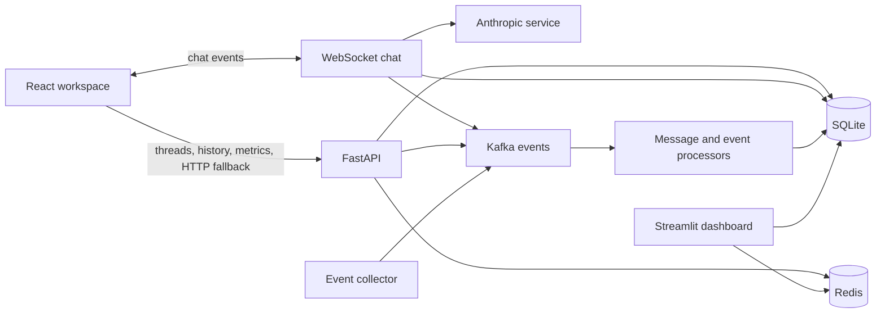
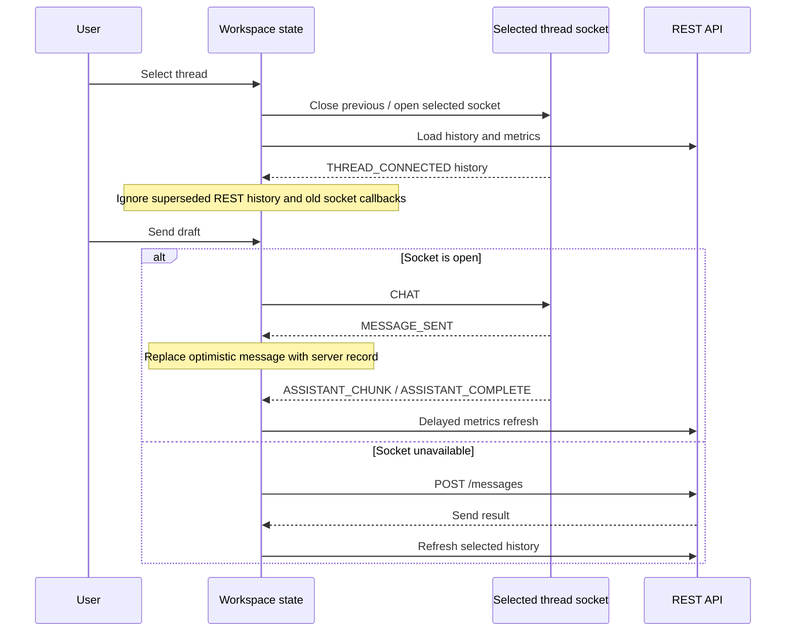

# AI Thread Billing architecture

The product is a single React workspace, with a thread list and Chat/Billing Details tabs. There is no frontend router or authentication flow. `frontend/src/App.js` renders the interface; `useWorkspace.js` owns transport, selection, drafts and recovery; `endpoints.js` derives WebSocket addresses from the configured API origin.

This diagram describes source responsibilities, not verified runtime health. The API mounts REST routes under `/api` and WebSocket routes under `/ws`. Backend startup invokes database initialization/update routines and Kafka processor startup. Docker Compose shares the SQLite volume between the backend and dashboard.

## Frontend state boundaries

Selecting a thread clears its displayed history and metrics, closes the previous socket, and opens the new thread’s transport. Each thread keeps its own draft. Async history and metrics responses must still belong to the active selection before updating the screen; a metrics request sequence also rejects superseded refreshes. A selection generation protects HTTP-send refreshes across a switch away and back to the same thread.

A failed HTTP send keeps the draft. A successful send clears only the matching thread draft; if history refresh fails afterward, the UI says the message was sent and suggests reopening the thread. WebSocket sends are optimistic; a later service error is visible, but this prototype has no delivery guarantee or automatic reconnect.

## Usage and invoice contract

`backend/app/api/billing.py` exposes per-user and per-thread metrics. The React workspace uses `/api/billing/metrics/thread/{thread_id}` and `?refresh=true` for a forced refresh. Metrics include message counts, input/output token totals, total cost and last activity. The frontend displays the reported total rather than recomputing cost from hardcoded model prices. Backend rates are configuration/database values, not a guarantee of current provider pricing.

Metrics can lag event processing. The frontend retries failures and zero-token records with existing messages up to four attempts, then offers explicit recovery. It does not assert a processing SLA.

The backend also has a POST invoice-generation route and invoice listing. The React workspace does not invoke them. This audit changes frontend behavior only; it does not verify invoice accounting, processor delivery or backend authorization. The seeded account is a development fixture, not a signed-in identity.

## Release boundary

Frontend CI produces a static CRA build. Hosting that build requires a separately configured backend reachable over matching HTTP/WS or HTTPS/WSS origins and an appropriate backend CORS policy. No hosting configuration, backend release pipeline or published service URL is established here. Full Compose startup remains unverified.

Source anchors: [workspace](../frontend/src/App.js), [state hook](../frontend/src/useWorkspace.js), [transport](../frontend/src/endpoints.js), [API startup](../backend/app/main.py), [chat events](../backend/app/api/websockets.py), [billing routes](../backend/app/api/billing.py), [Compose services](../docker-compose.yml).
