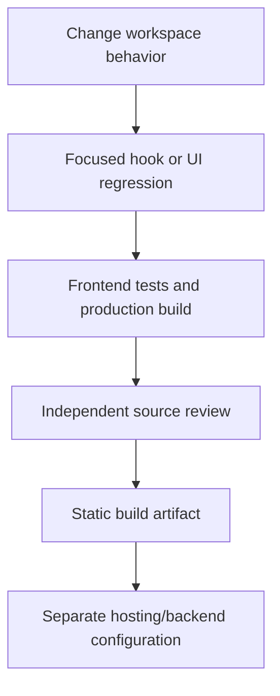

# Developer guide

Install the frontend from its committed lockfile using Node.js 22 and `npm ci` in `frontend/`. Start CRA with `npm start`. The backend is a separate dependency/runtime boundary; frontend unit tests require neither Docker nor an AI API key.

## Configuration

`REACT_APP_API_URL` defaults to `http://localhost:8000/api` and is embedded by CRA when starting/building. For another backend, supply an HTTP or HTTPS API URL. `chatSocketUrl` uses its origin, changes HTTP to WS or HTTPS to WSS, and constructs `/ws/chat/{user}/{thread}`. Custom reverse proxies must expose that WebSocket path in addition to the API prefix. Credential-bearing URLs and non-HTTP protocols are rejected for chat transport.

```bash
cd frontend
REACT_APP_API_URL=https://backend.example/api npm run build
```

The example hostname is illustrative; it is not a deployed project endpoint. Backend CORS currently allows all origins for development in `backend/app/main.py`; restrict it to the intended frontend origin before production use.

Backend settings live in `backend/app/core/config.py`. Copy [`.env.example`](../.env.example) to a private `.env` at the repository root. The example contains placeholders and the development defaults; do not put a real API key in the tracked file. `Settings` reads:

| Variable | Role |
| --- | --- |
| `DEBUG` | FastAPI debug flag. Default `false`. |
| `DATABASE_URL` | SQLAlchemy URL. Default `sqlite:///data/billing.db`. |
| `REDIS_URL` | Redis URL. Default `redis://redis:6379/0`. |
| `KAFKA_BOOTSTRAP_SERVERS` | Kafka broker list. Default `kafka:9092`. |
| `ANTHROPIC_API_KEY` | Provider key. Empty by default. Compose interpolates `${ANTHROPIC_API_KEY}` into the backend service. |
| `DEFAULT_INPUT_TOKEN_PRICE` | USD per input token. Default `0.000001`. |
| `DEFAULT_OUTPUT_TOKEN_PRICE` | USD per output token. Default `0.000005`. |

`docker-compose.yml` also names `REACT_APP_API_URL` on the frontend and the Bitnami Kafka/ZooKeeper settings `KAFKA_CFG_ZOOKEEPER_CONNECT`, `KAFKA_CFG_ADVERTISED_LISTENERS`, `ALLOW_PLAINTEXT_LISTENER`, and `ALLOW_ANONYMOUS_LOGIN`. Those values are assigned in the Compose file. A private `.env` does not override them. `DEFAULT_MODEL` is a constant in `Settings` (`claude-3-5-haiku-20241022`), not an environment variable.

## Tests and release artifact

```bash
npm test -- --watchAll=false --maxWorkers=2
npm run build
```

The tests mock Axios and WebSocket at the network boundary and exercise the actual state hook and rendered controls. They cover failed-send draft retention, late thread responses, old socket events, assistant-completion refresh, billing retry/recovery, server acknowledgement replacement, transport origins and accessible panels. They do not open real chat sockets or generate invoices. Responsive styles are present in source; browser geometry is a separate verification step.

GitHub Actions installs the frontend lockfile, runs tests with two workers, builds CRA, and uploads `frontend/build` as `frontend-static-build`. The artifact is a static frontend release candidate, not an automatically deployed application. MDX/Mermaid docs are source files; a renderer is not included.

## Making changes

Keep visual structure in `App.js`/`WorkspaceView`, shared state in `useWorkspace.js`, and transport helpers in `endpoints.js`. `WorkspaceView` accepts explicit state/actions so inert source-rendered design previews can use synthetic fixtures without mounting network effects. Preserve the HTTP fallback, IME composition and Shift+Enter behavior when changing the composer.



Do not use the seeded user as a production identity. Before live service validation, understand that backend startup initializes development database data, chat may call Anthropic, and the existing invoice POST persists invoice records. Use isolated fixtures for regression tests. The repository contains a historical tracked `backend/venv`; the frontend workflow neither uses nor repairs it.

See [architecture](architecture.mdx), [workspace guide](user-guide.mdx) and [README](../README.md).
